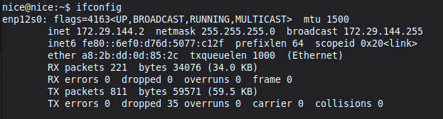
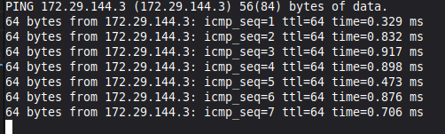
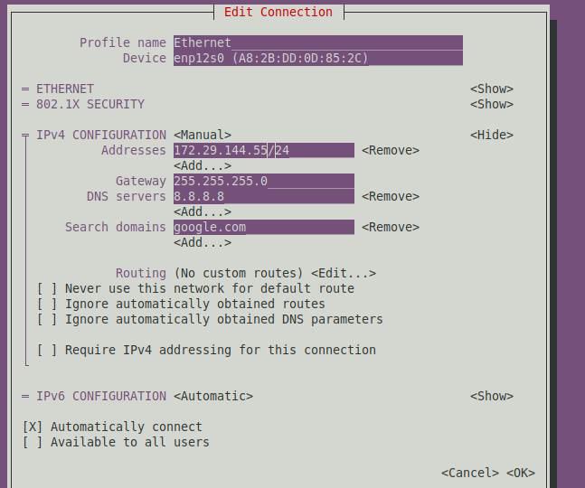
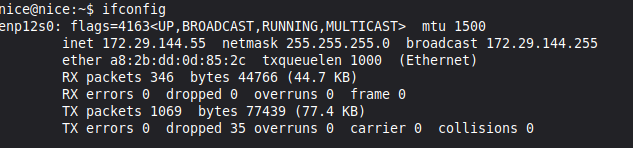
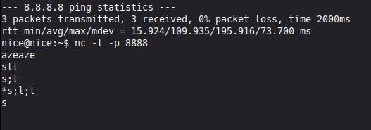
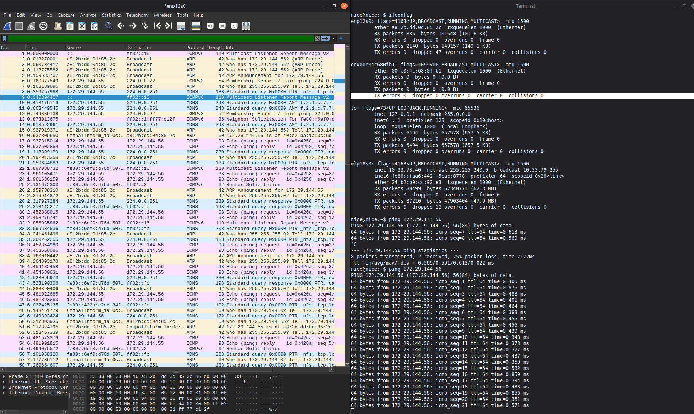
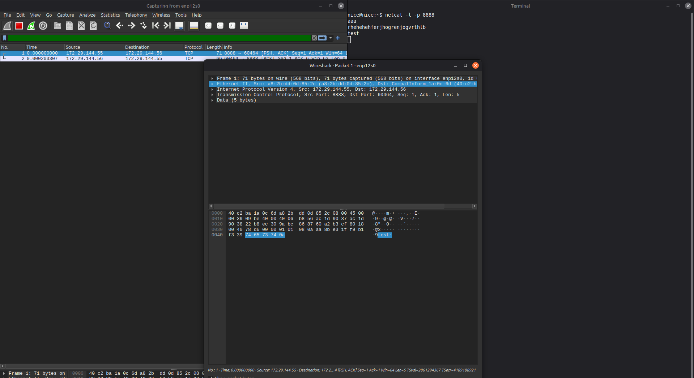

## TP 2 - Exploration du réseau d'un point de vue client

### I. Exploration locale en solo

#### 1. Affichage d'informations sur la pile TCP/IP locale

<!-- En utilisant la ligne de commande (CLI) de votre OS :
Affichez les infos des cartes réseau de votre PC

nom, adresse MAC et adresse IP de l'interface WiFi
nom, adresse MAC et adresse IP de l'interface Ethernet
déterminer, pour chacune d'entre elles :

adresse de réseau
adresse de broadcast -->

Pour commencer, j'ai utilisé la commande 'ifconfig'

#### **Interface wifi** 
```
en0: flags=8863<UP,BROADCAST,SMART,RUNNING,SIMPLEX,MULTICAST> mtu 1500
	options=6460<TSO4,TSO6,CHANNEL_IO,PARTIAL_CSUM,ZEROINVERT_CSUM>
	ether c2:c3:21:71:b7:50
	inet6 fe80::18f1:5783:bce9:c881%en0 prefixlen 64 secured scopeid 0xb 
	inet 10.33.70.18 netmask 0xfffff000 broadcast 10.33.79.255
	nd6 options=201<PERFORMNUD,DAD>
	media: autoselect
	status: active
```
nom : en0  
adresse MAC : c2:c3:21:71:b7:50  
adresse IP : 10.33.70.18  

adresse réseau : 10.33.00.00  
broadcast :  10.33.79.255  

Pour obtenir l'adresse de la gateway, j'utilise la commande `route get default | grep gateway`

```
route get default | grep gateway
    gateway: 10.33.79.254
```

### En graphique (GUI : Graphical User Interface)

  

adresse MAC : c2:c3:21:71:b7:50  
adresse IP : 10.33.70.18  
gateway : 10.33.79.254

#### Questions
À quoi sert la gateway dans le réseau d'Ynov ?

Sur le réseau d'Ynov, la gateway permet de relier les différents réseaux entre eux.

### 2. Modifications des informations

#### A. Modification d'adresse IP - pt. 1

**J'ai effectué les opérations qui suivent sur mon réseau personnel avec une VM sous ParrotOS car le réseau d'Ynov ne me permettait pas de scanner avec nmap correctement**


```
Adresse IP : 192.168.64.18
Netmask : 255.255.255.0
Broadcast : 192.168.64.255
```
J'en déduis que l'adresse réseau est `192.168.64.0`, car lorsque l'on superpose l'adresse IP et le netmask, on voit que le dernier numéro pour le netmask est 0.

Comme le broadcast utilise l'adresse `192.168.64.255`, on en déduit que la dernière adresse IP disponible est au moins `192.168.64.254`

Pour continuer, j'ai décidé de changer mon ip en `192.168.64.56`. Pour cela, j'ai utilisé la commande suivante

`ip addr add 192.168.64.56/24 dev enp0s1`

Je fais en suite un `ifconfig`pour vérifier si mon adresse IP a bien été changée,


On peut voir que le changement a été correctement effectué.

#### B. nmap

Pour continuer, j'ai scanné l'adresse réseau que j'ai obtenu à l'aide les opérations précédentes.

Pour ça j'ai fait `nmap -sN -PE 192.168.64.0/24`


Comme l'indique la ligne `(2 hosts up)`, on peut comprendre que le réseau est utilisé par deux appareils. En l'occurence ma machine `192.168.64.18`, et probablement par la gateway.

#### C. Modification d'adresse IP - pt. 2

## II. Exploration locale en duo (Faites avec Zyad & Louis)

Pour commencer cette partie du TP, on se connecte en RJ45, puis on vérifie notre ip.



On ping notre camarade connecté sur le même réseau



On modifie ensuite notre ip avec 

```
nmtui
```




On modifie notre IP, on redémarre le réseau, et on regarde si le changement a été pris en compte



Pour continuer, on va essayer de désactiver le WI-FI sur un des deux appareils pour que celui connecté serve de passerelle

#### 5. Petit chat privé ?

Pour cette partie, on utilise la commande `netcat -l -p 8888` pour écouter sur le port 8888.

L'appareil 2 se connecte alors à l'ip de l'appareil 1 avec

```
netcat <ip appareil_1> 8888
```

Ce qui permet aux deux appareils de communiquer entre eux.


	 

### 6. Wireshark

Pour cette partie, on va utiliser Wireshark durant différentes actions réseaux.

Pour débuter, on effectue un ping lorsque Wireshark observe ce qu'il se passe sur ma carte Ethernet



On peut observer que l'appareil 1 (172.29.144.55) fait des requêtes du moment qu'il ping l'appareil 2 (172.29.144.56)

Lors d'un netcat, on peut voir que ce que l'on écrit dans le terminal apparaît bien dans les trames Wireshark ("test")



7

## III. Manipulations d'autres outils/protocoles côté client

### 1. DHCP

Pour cette partie, j'ai commencé par afficher l'adresse IP du DHCP avec la commande.


```
DHCP4.OPTION[3]:                        dhcp_server_identifier = 192.168.64.1
DHCP4.OPTION[5]:                        expiry = 1769514754
```

On a donc l'adresse IP du DHCP et son bail d'expiration.

Pour finir sur cette partie, j'ai demandé une nouvelle adresse au DHCP à l'aide de deux commandes.

```
sudo dhclient -r enp0s1
sudo dhclient enp0s1
```

La première permettant de libérer l'adresse IP utilisé, la seconde pour en associer une nouvelle à ma carte réseau.


### 2. DNS

Pour cette partie, j'ai tout d'abord effectué la commande `dig google.com` afin d'obtenir l'adresse Ip de google
et celle d'ynov

`dig google.com = 142.251.142.14`

```
dig ynov.com = 104.26.11.233
			   104.26.10.233
			   172.67.74.226
```
