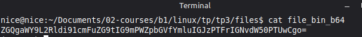
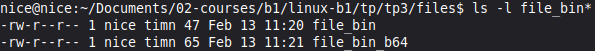
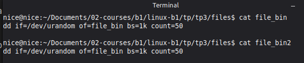
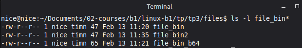

# B1 Linux - TP3

## I. Exploration en solo
### 1. Base64

Pour  commencer, j'ai créer le fichier nommé `file_bin` contenant `dd if=/dev/urandom of=file_bin bs=1k count=50`

Puis je l'ai ensuite encodé avec **Base64** 


`openssl base64 -e -in file_bin -out file_bin_b64`

Pour vérifier si le fichier était bien encodé en base64 j'ai fait `cat file_bin_b64`



On vérifie alors quelle taille font les deux fichiers avec 

```
ls -l file_bin*
```

On peut voir que le fichier encodé est un peu plus lourd (65 bytes contre 47 bytes)



On essaye de redécoder le fichier encodé en base64 avec la commande
`openssl base64 -d -in file_bin_b64 -out file_bin2` pour vérifier si l'on réobtient bien le fichier que l'on avait à l'origine.



On peut voir que c'est bien le cas grâce au contenu du fichier. De plus `file_bin2` fait bel et bien la même taille que le fichier d'origine `file_bin`.

