# B1 Linux - TP3

## I. Exploration en solo
### 1. Base64

Pour  commencer, j'ai créer le fichier nommé `file_bin` contenant `dd if=/dev/urandom of=file_bin bs=1k count=50`

Puis je l'ai ensuite encodé avec **Base64** 


`openssl base64 -e -in file_bin -out file_bin_b64`

Pour vérifier si le fichier était bien encodé en base64 j'ai fait `cat file_bin_b64`


On vérifie alors quelle taille font les deux fichiers avec 

```
ls -l file_bin*
```

On peut voir que le fichier encodé est un peu plus lourd (65 bytes contre 47 bytes)


On essaye de redécoder le fichier encodé en base64 avec la commande
`openssl base64 -d -in file_bin_b64 -out file_bin2` pour vérifier si l'on réobtient bien le fichier que l'on avait à l'origine.


On peut voir que c'est bien le cas grâce au contenu du fichier. De plus `file_bin2` fait bel et bien la même taille que le fichier d'origine `file_bin`.


### 2. AES (Chiffrement symétrique)

Pour débuter cette partie du TP, on va générer un fichier avec tous les mots du dictionnaire avec ker comme sous-chaîne.

Pour cela, on utilise la commande

```
cat /usr/share/dict/words | grep ker  | tr "\n" " " >message
```

On vérifie que l'on ait bien le message avec le contenu avec `cat message`

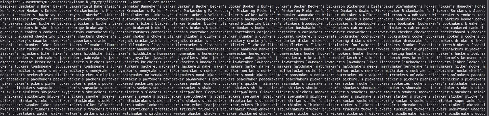

On chiffre ensuite le message avec

```
openssl enc -e -salt -in message -out message_c -aes256 -pbkdf2 -md sha256

```

Le fichier fait planter mon PC lorsque j'essaye de le lire avec `cat message`

Je passe ensuite au déchiffrement avec 

```
openssl enc -d -in message_c -aes256 -pbkdf2 -md sha256
```
Le fichier décodé nous ressort notre liste de mots du dictionnaire.

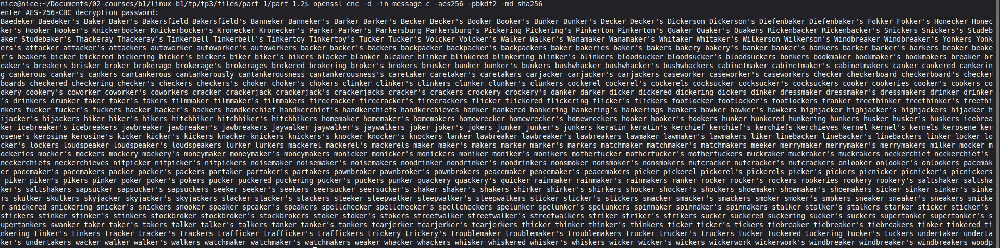

On chiffre et on encode ensuite avec base64 via

```
openssl enc -e -a -salt -in message -out message_c2 -aes256 -pbkdf2 -md sha256
```

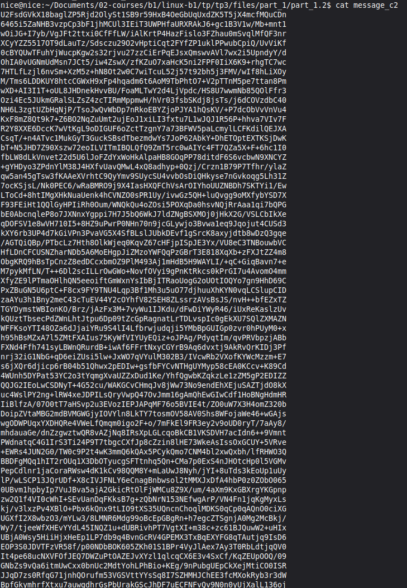

### 3. RSA (Chiffrement asymétrique)

On commence par générer une paire de clés RSA avec 

``` 
openssl genrsa -out cle_ynov.pem 2048
```

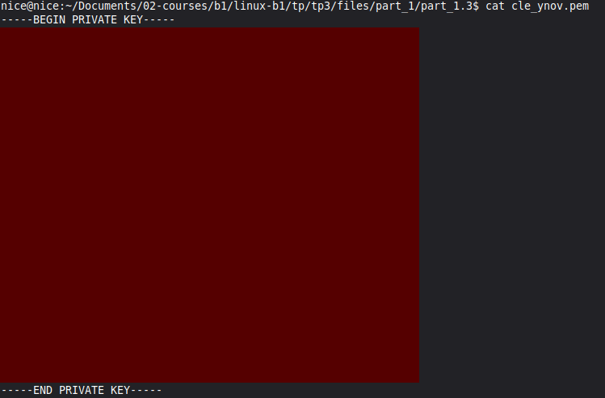

Pour chiffre notre clé générée. On utilise la commande utilisée lors de la partie précédente :

```
openssl enc -e -salt -in cle_ynov.pem -out AES_cle_ynov.pem -aes256 -pbkdf2 -md sha256
```

Et quand on essaye de lire le fichier on voit que ça marche.

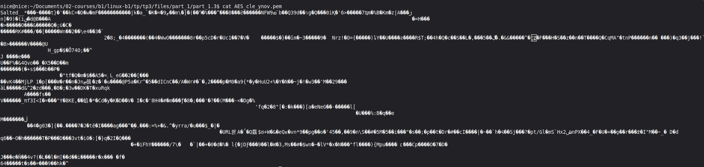

On exporte ensuite la clé publique de la paire de clés RSA avec

`openssl rsa -in cle_ynov.pem -pubout -out clepublique_ynov.pem`

Et quand on vérifie ses paramètres avec `openssl rsa -in clepublique_ynov.pem -pubin -text -noout`. On observe qu'il ne reste que le `modulo`

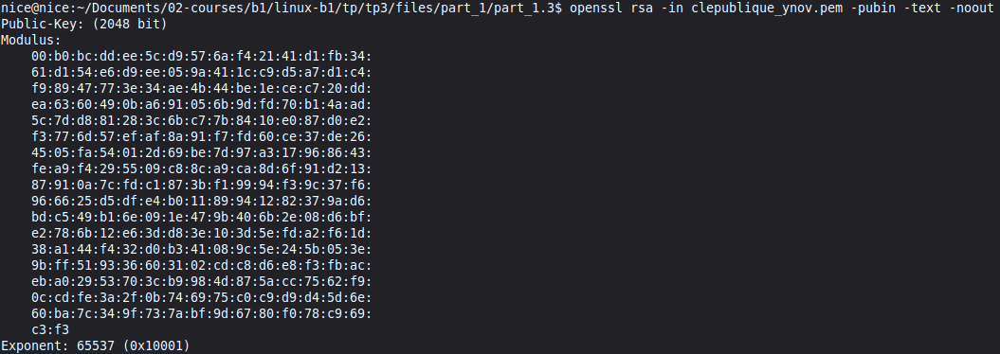

On crée ensuite la passphrase avec `nano pass_ynov` puis on le chiffre avec la clé publique 

```
openssl pkeyutl -encrypt -in pass_ynov -inkey clepublique_ynov.pem -pubin -out pass_ynov_c
```

Et pour déchiffrer le fichier avec la clé privée 

```
openssl pkeyutl -decrypt -in pass_ynov_c -inkey cle_ynov.pem
```

## II. Sans que je vous file les réponses à chaques étapes
## A. Base64
### 1. Génération d’un fichier binaire

On crée un fichier `data.bin` avec

```
dd if=/dev/urandom of=data_bin bs=1k count=100
```

Lorsque l'on vérifie la taille du fichier avec `ls -l`, on voit qu'il fait `102400 bytes` soit `102,4 kB`

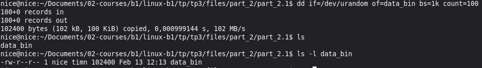

### 2. Encodage

On encode ensuite le fichier en base64 avec

```
openssl base64 -e -in data_bin -out data_bin_b64
```
Et on vérifie son contenu. 

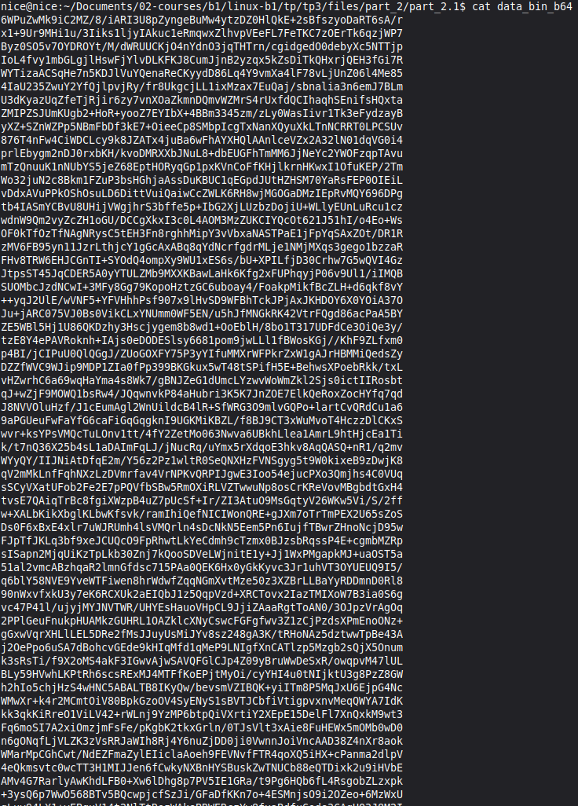

On vérifie la différence de taille des deux fichiers, et l'on voit que le fichier encodé en base64 est plus lourd que celui non encodé.

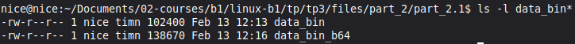

### 3. Décodage

On décode enfin le fichier avec

```
openssl base64 -d -in data_bin_b64 -out data_bin2
```

et l'on vérifie que l'on ait bien le même fichier qu'à l'origine

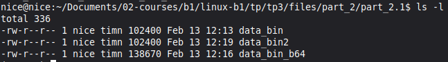

C'est bien le cas ici.

### 4. Questions

**Base64 est-il un chiffrement ? Pourquoi ?**

Non, il encode, mais il ne permet pas de chiffrer les donnéees, il n'utilise pas de clé. On peut le décoder très facilement et rapidement

**Pourquoi la taille du fichier change-t-elle après encodage ?**

La taille du fichier change après encodage car le Base64 utilise 64 caractères pour représenter les données. Chaque information est encodé via plusieurs symboles.

**Quel est approximativement le pourcentage d’augmentation ?**

Le pourcentage d'augmentation est d'environ de 33% car il ajoute environ 4% d'informations.

**Quelle méthode permet de vérifier rigoureusement que deux fichiers sont identiques ?**

Pour vérifie que deux fichiers sont identiques, on vérifie le hash des fichiers.

## B. Chiffrement symétrique – AES
### 1. Création d’un message

On commence par crée un fichier nommé `confidentiel.txt`

### 2. Chiffrement

On encode ensuite le fichier avec

```
openssl enc -e -salt -in confidentiel.txt -out confidentiel.enc -aes256 -pbkdf2 -md sha256
```

Et l'on vérifie qu'il soit bien en binaire avec `file confidentiel.enc`.

### 3. Déchiffrement

On décode ensuite le fichier

```
openssl enc -d -aes-256-cbc -pbkdf2 -iter 100000 -md sha256 -in confidentiel.enc -out confidentiel_dechiffre.txt
```

On tape le mot de passe, et on vérifie que notre fichier corresponde, c'est bien le cas ici.

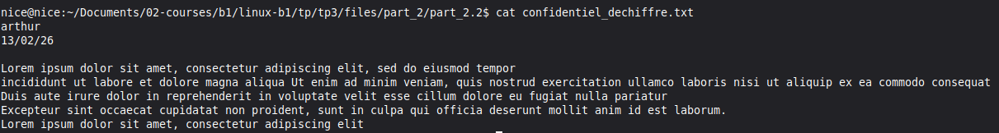

### 4. Analyse


Enfin on réeffectue le chiffrement, et on vérifie le hash du nouveau fichier obtenu avec

```
sha256sum confidentiel.enc confidentiel2.enc
```

On voit que les hash des deux fichiers, sont différents.


### 5. Questions


**Pourquoi les deux fichiers chiffrés sont-ils différents ?**

Les deux fichiers sont différents car le sel est un élément aléatoire généré à chaque commande.

**Quel est le rôle du sel ?**

Il permet d'ajouter une couche de données aléatoires pour assurer plus de sécurité.

**Que se passe-t-il si une option change lors du déchiffrement ?**

Lorsque l'on change une option lors du déchiffrement, celui-ci échoue

**Pourquoi utilise-t-on PBKDF2 ?**
*

**Quelle est la différence entre encodage et chiffrement ?**

L'encodage modifie le format sans clé secrete, alors que le chiffrement le fait avec une clé secrete, ce qui permet d'ajouter une couche de sécurité.


## C. Cryptographie asymétrique – RSA
### 1. Génération de clés

Tout d'abord, on génère une paire de clés privée/publique.

Pour cela on utilise la commande

```
openssl genrsa -out rsa.pem 2048
```

On obtient donc une paire de clés, et on chiffre ensuite la clé privée à l'aide d'un chiffrement AES en faisant 

```
openssl enc -e -salt -in rsa_private.pem -out AES_rsa_private.pem -aes256 -pbkdf2 -md sha256
```

On peut enfin extraire notre clé publique avec 

```
openssl rsa -in rsa_private.pem -pubout -out rsa_public.pem
```

Pour afficher les paramètres détaillés de la clé privée. :
```
openssl rsa -in rsa_private.pem -text -noout
```

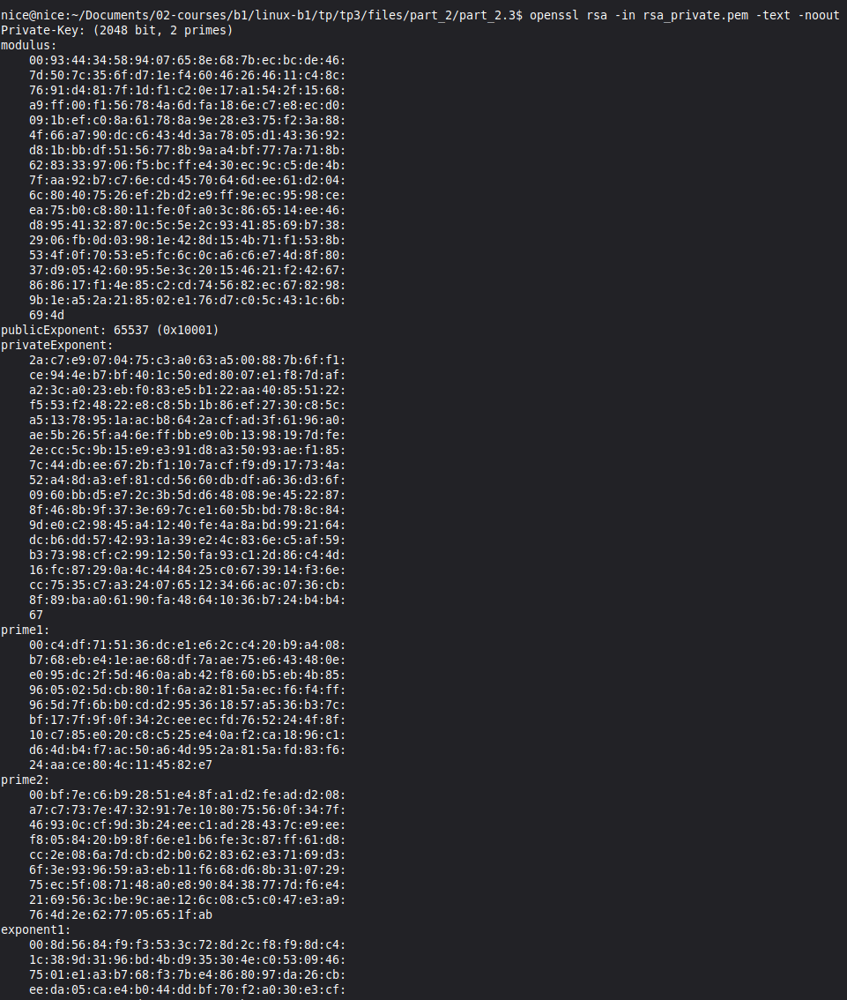

Pour afficher les paramètres détaillés de la clé publique. :

```
openssl rsa -in rsa_public.pem -pubin -text -noout
```

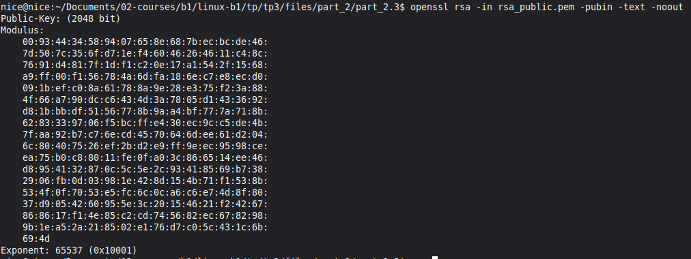

On peut voir que la clé publique n'affiche que le modulus, alors que la clé privée affiche plusieurs paramètres tels que les prime1/2, le coefficient ainsi que les exponents.

### 2. Chiffrement asymétrique

Tout d'abord on crée un fichier secret.txt

Ensuite on chiffre avec la commande

```
openssl pkeyutl -encrypt -in secret.txt -inkey rsa_public.pem -pubin -out secret.enc
```

Pour déchiffrer notre fichier avec la clé privée on utilise ensuite

```
openssl pkeyutl -decrypt -in secret.enc -inkey rsa_private.pem
```

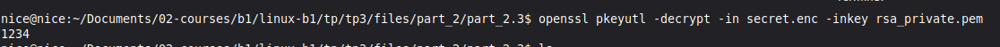
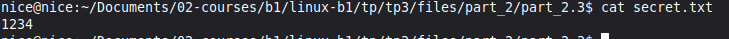

### 3. Questions


**Pourquoi la clé privée ne doit-elle jamais être partagée ?**

Cette clé ne doit jamais être partagée car elle contient diverses informations qui pourraient être compromises.

**Pourquoi RSA n’est-il pas adapté au chiffrement de gros fichiers ?**

Car il est très gourmand en ressources.

**Quelles différences observe-t-on entre les paramètres d’une clé publique et d’une clé privée ?**

Avec la clé privée, on a acccès aux exponents, au coefficient et au modulus, tandis que la clé publique n'affiche que le modulus.

**Quel est le rôle du modulo dans RSA ?**

Le modulo est le reste dans une division, il correspond donc à la partie mathématiques de la cryptographie. Il va permettre de ne pas effectuer le calcul inverse pour déchiffrer la clé, la rendant plus sécurisée.

Pourquoi utilise-t-on souvent RSA pour chiffrer une clé AES plutôt qu’un document entier ?

## D. Signature numérique
### 1. Création et signature

Tout d'abord on crée un fichier contrat.txt duquel on va générer son hash avec
 
```
openssl dgst -sha256 -sign rsa_private.pem -out contrat.sig contrat.txt
```

### 2. Vérification

On vérifie ensuite la signature avec la clé publique avec

```
openssl dgst -sha256 -verify rsa_public.pem -signature contrat.sig contrat.txt
```
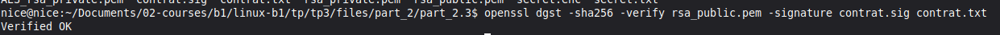

On modifie ensuite le fichier contrat.txt et on revérifie avec la même commande

On peut voir ici que la vérification a échoué car les deux fichiers ne sont plus semblables, et donc que leur hash ne l'est plus non plus

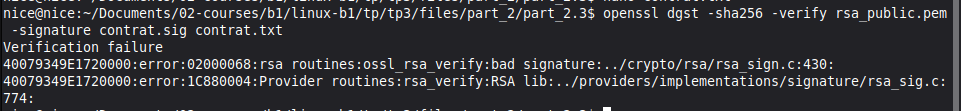


3.Questions


**Que se passe-t-il après modification du fichier ?**

On a une erreur lors de la vérification des deux fichiers.

**Pourquoi ?**

En changeant le contenu du fichier contrat.txt, on change son hash, donc la vérification échoue.


**Quel est le rôle du hachage dans le mécanisme de signature ?**

Il permet de vérifier l'authenticité d'un fichier grâce à sa signature. Notamment sur les sites de téléchargement. 

**Quelle différence entre signature numérique et chiffrement ?**

Lors du chiffrement on utilise notre clé privée pour chiffrer, et lors de la signature on utilise notre clé publique.